### 平台简介

  ArtBlog is an open source blog built with Quasar and Vue3 and Gogin. Trying to build an art sharing blog that you can share art works and comment on them from a seated position in picture

### 演示图


demo in using:
http://8.134.9.37
(I'm sorry the website is temporarily unavailable)
username: admin
password: 123456


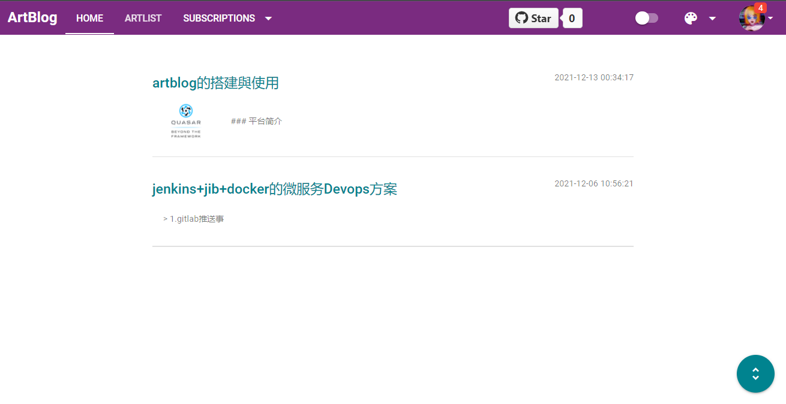
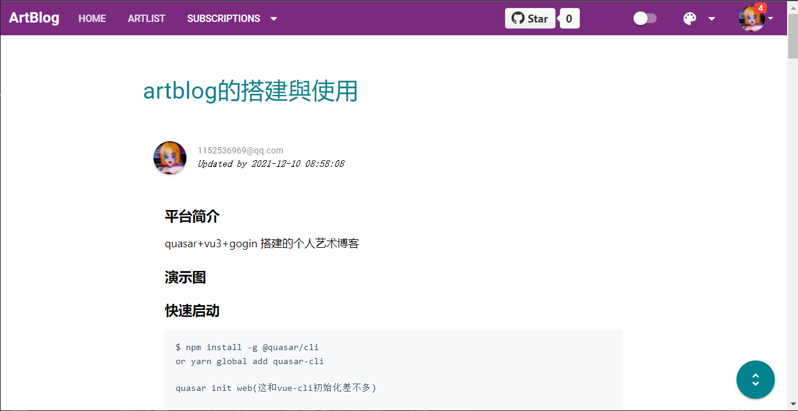
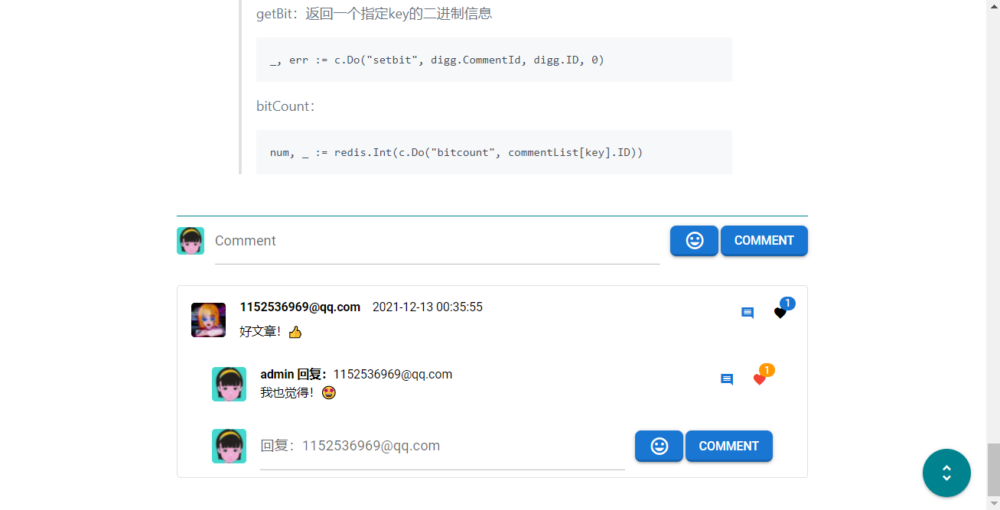
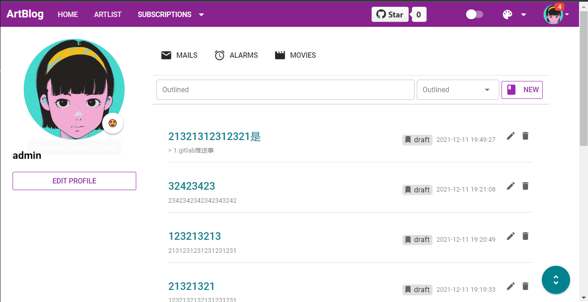
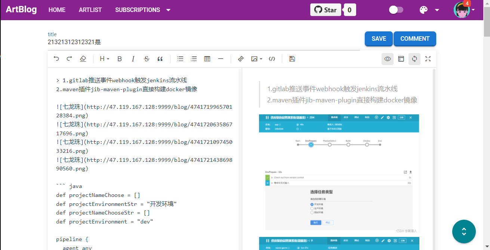
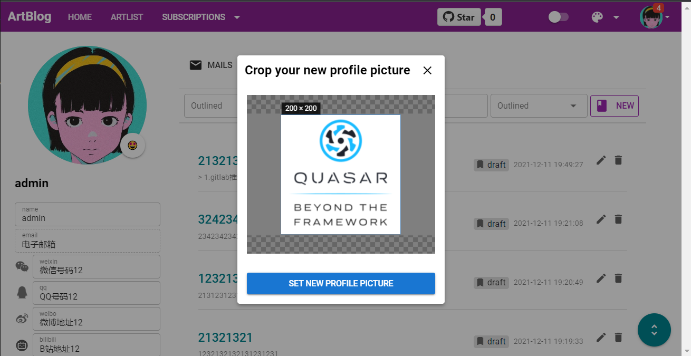
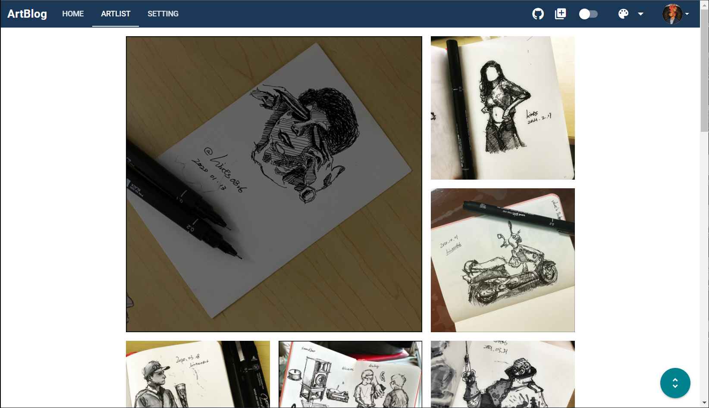
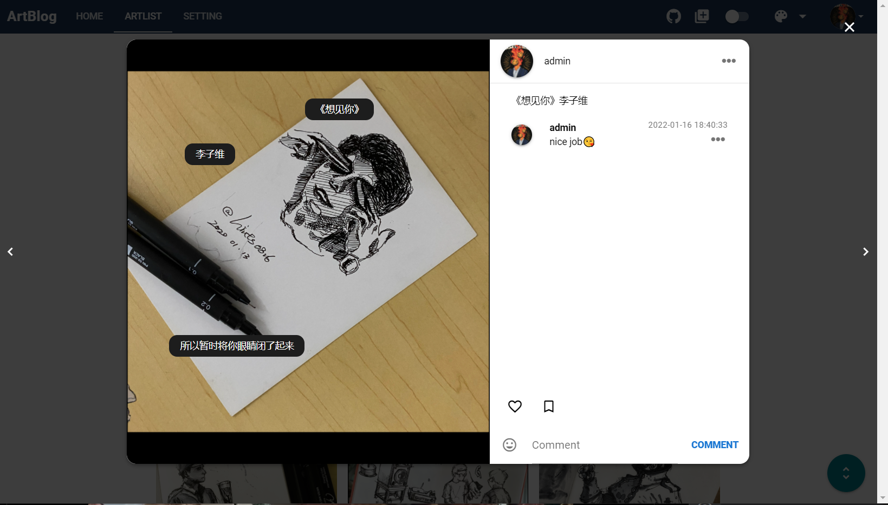
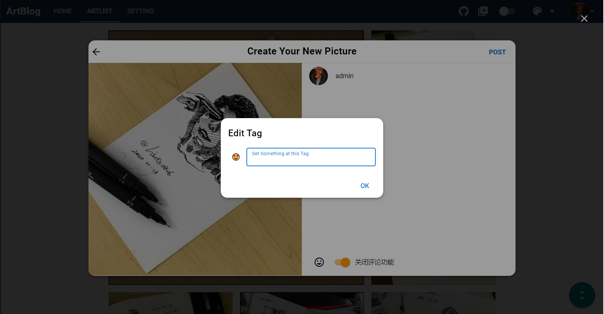
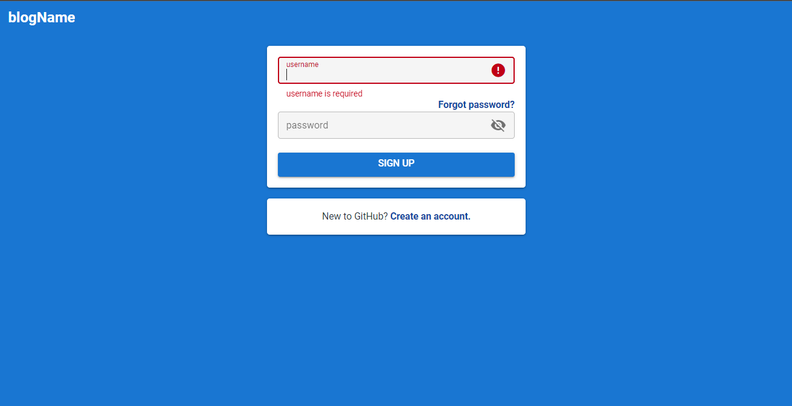
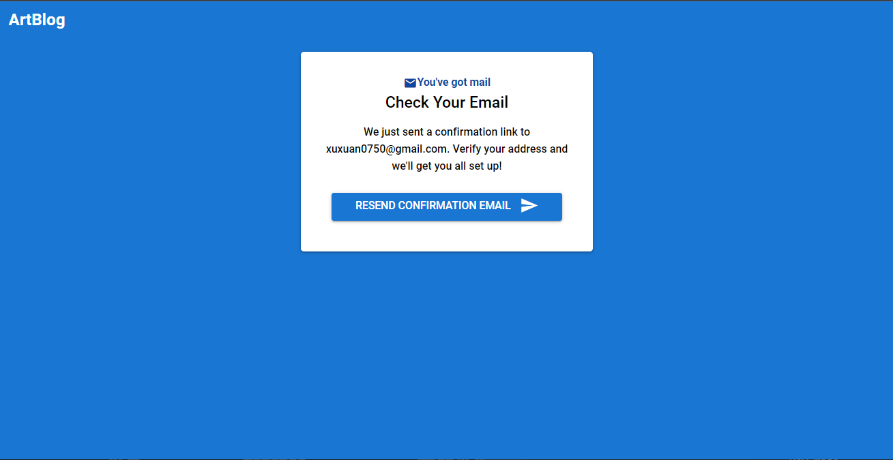
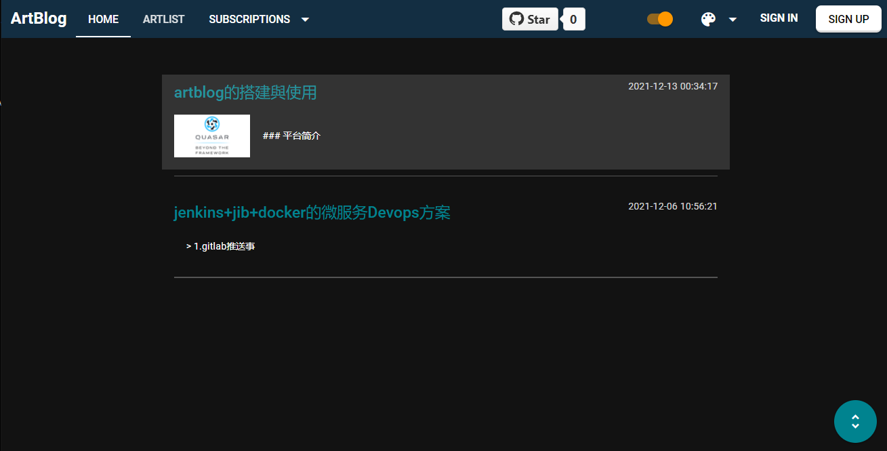
phone
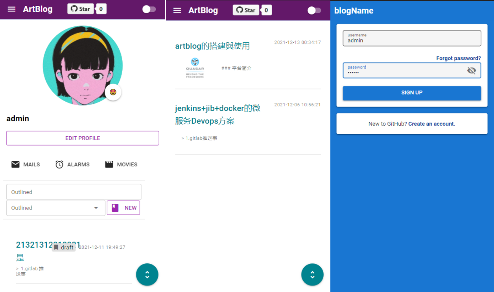
### Quick Start

```bash
$ npm install -g @quasar/cli
or yarn global add quasar-cli

quasar init web(这和vue-cli初始化差不多)

go mod tidy

Running quasar:
quasar dev
Building quasar：
quasar build

Running Go：
go run main.go
```


1.quasar整合vue-cropper

> 在src/boot下新建cropper.ts（注：全局组件引入方法如下）
>
> ```
> import VueCropper from 'vue-cropper'; 
> import 'vue-cropper/dist/index.css'
> import { boot } from 'quasar/wrappers';
> 
> export default boot(({ app }) => {
>     app.use(VueCropper)
> });
> ```
>
> 编辑/quasar.conf.js： boot: [ 'cropper' ]
>
> https://github.com/xyxiao001/vue-cropper/blob/master/english.md

2.quasar整合v-md-edit

> 在src/boot下新建markdown.ts（注：全局组件引入方法如下）
>
> ```
> import { boot } from 'quasar/wrappers';
> import VueMarkdownEditor from '@kangc/v-md-editor';
> import '@kangc/v-md-editor/lib/style/base-editor.css';
> import vuepressTheme from '@kangc/v-md-editor/lib/theme/vuepress.js';
> import '@kangc/v-md-editor/lib/theme/style/vuepress.css';
> 
> import VMdPreviewHtml from '@kangc/v-md-editor/lib/preview-html';
> import '@kangc/v-md-editor/lib/style/preview-html.css';
> 
> import Prism from 'prismjs';
> 
> import VMdPreview from '@kangc/v-md-editor/lib/preview';
> import '@kangc/v-md-editor/lib/style/preview.css';
> import githubTheme from '@kangc/v-md-editor/lib/theme/github.js';
> import '@kangc/v-md-editor/lib/theme/style/github.css';
> 
> // highlightjs
> import hljs from 'highlight.js';
> 
> export default boot(({ app }) => {
>   VMdPreview.use(githubTheme, {
>     Hljs: hljs,
>   });
>   VueMarkdownEditor.use(vuepressTheme, {
>     Prism,
>   })
>   app.use(VueMarkdownEditor);
>   app.use(VMdPreviewHtml);
>   app.use(VMdPreview);
> });
> ```
>
> ```
> <v-md-editor 
> v-model="content_text" 
> height="90%"
> :disabled-menus="[]"
> @upload-image="handleUploadImage"
> ></v-md-editor>
> ```
>
> 更多api请看：http://ckang1229.gitee.io/vue-markdown-editor/zh/

3.quasar 内置图标插件如何使用，外置图标如何引入

> 编辑/quasar.conf.js：
> extras: [  'material-icons' ，'fontawesome-v5'  ]、
>
> 使用：quasar官网有使用方法<q-icon name="..." />
>
> 外置图标引入：静态资源文件放置在public

4.go如何与minio整合?minio如何做预览功能？

> linux安装minio
>
> wget https://dl.min.io/server/minio/release/linux-amd64/minio
>
> chmod +x minio
>
> MINIO_ROOT_USER=admin MINIO_ROOT_PASSWORD=password minio server --console-address :9000 	--address :9999 /usr/local/data
> 注：新版的minio控制台端口和api的端口是分开的
>
> 安装客户端：
>
> wget https://dl.minio.io/client/mc/release/linux-amd64/mc --output mc
>
> chmod 777 mc
>
> ./mc config host add minio http://127.0.0.1:9999 admin password
>
> ./mc policy set public minio/blog
>
> 配置启动项
>
> cd /etc/systemd/system
>
> wget https://raw.githubusercontent.com/minio/minio-service/master/linux-systemd/minio.service
>
> ```
> [Unit]
> Description=MinIO
> Documentation=https://docs.min.io
> Wants=network-online.target
> After=network-online.target
> AssertFileIsExecutable=/usr/local/minio/minio
> [Service]
> User=root
> Group=root
> EnvironmentFile=/usr/local/minio/conf/minio.conf
> ExecStart=/usr/local/minio/minio server $MINIO_OPTS $MINIO_VOLUMES
> Restart=always
> LimitNOFILE=65536
> TimeoutStopSec=infinity
> SendSIGKILL=no
> [Install]
> WantedBy=multi-user.target
> ```
>
> minio.conf
>
> ```
> MINIO_VOLUMES="/usr/local/data"
> MINIO_OPTS="--console-address :9000 --address :9999"
> MINIO_ROOT_USER="minio"
> MINIO_ROOT_PASSWORD="12345678"
> ```
>
> ```
> systemctl daemon-reload
> systemctl restart minio.service
> systemctl status minio.service
> ```
>
> go整合 minio
>
> https://github.com/minio/minio-go/

5.邮件服务器如何对接？476,587,25分别是什么端口

```
import "github.com/jordan-wright/email"
e := email.NewEmail()
e.From = "dj <1152536969@qq.com>"//设置发送方的邮箱
e.To = []string{emailName}// 设置接收方的邮箱
e.Subject = "Comfire Your Email Address"//设置主题
e.Text = []byte("<!DOCTYPE html></html>")//设置文件发送的内容(纯文字)
e.HTML = []byte("<!DOCTYPE html></html>")//设置文件发送的内容(html)
err := e.Send("smtp.qq.com:587",smtp.PlainAuth("","xxxxxxxxx@qq.com", "rrbjqp", "smtp.qq.com"))//rrbjqp是邮箱服务器的Key
if err != nil {
log.Fatal(err)
}
```

> 25也许可以在你本机上发送邮件，但是因为安全原因，很多云服务商对25端口进行了管制，465端口按道理来说是smtps协议，但是在阿里云服务器上无法发送

6.gogin中如何从上下文获取jwt的信息

> gogin路由设置jwt解析插件对header携带的token进行解析后放回*gin.Context中。
>
> 设置：
>
> c.Set("username", claims)
>
> 获取：
>
> usernamekey, _ := c.Get("username")
>
> userinfo, _ := usernamekey.(*middleware.MyClaims)

7.redis bitmap实现点赞统计

> ```
> import "github.com/garyburd/redigo/redis"
> var pool *redis.Pool //创建redis连接池
> func init() {
> 	pool = &redis.Pool{ //实例化一个连接池
> 		MaxIdle: 16, //最初的连接数量
> 		// MaxActive:1000000,    //最大连接数量
> 		MaxActive:   0,   //连接池最大连接数量,不确定可以用0（0表示自动定义），按需分配
> 		IdleTimeout: 300, //连接关闭时间 300秒 （300秒不使用自动关闭）
> 		Dial: func() (redis.Conn, error) { //要连接的redis数据库
> 			return redis.Dial("tcp", "xx.119.167.xx:6379", redis.DialPassword("xxxxxxx"))
> 		},
> 	}
> }
> ```
>
> ```
> c := pool.Get()
> defer c.Close()
> ```
>
> setBit：给一个指定key的值得第offset位 赋值为value。
>
> ```
> _, err := c.Do("setbit", digg.CommentId, digg.ID, 1)
> ```
>
> getBit：返回一个指定key的二进制信息
>
> ```
> _, err := c.Do("setbit", digg.CommentId, digg.ID, 0)
> ```
>
> bitCount：
>
> ```
> num, _ := redis.Int(c.Do("bitcount", commentList[key].ID))
> ```

